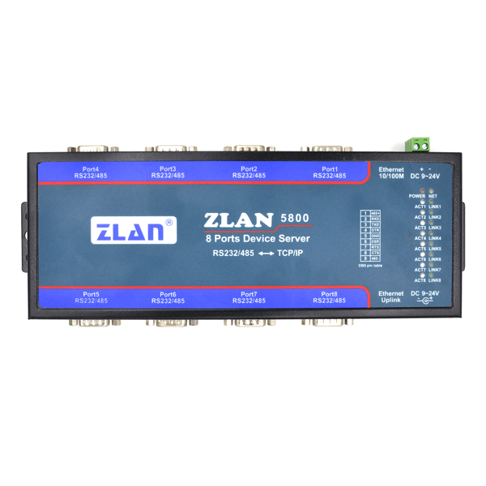
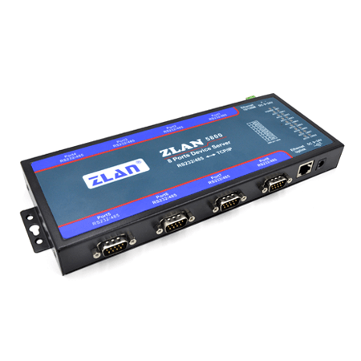
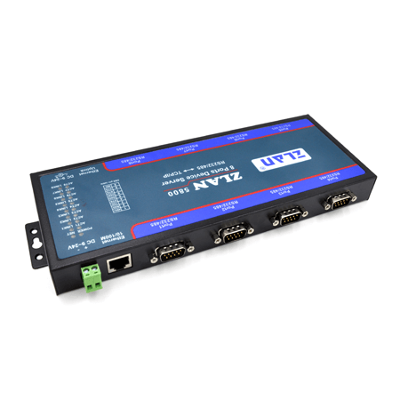

# SCADA

## 2018-11-30

### Diary

继续上个暑假的项目，重新搭建物联网平台，心累。

### Note

本次采用ZLAN5800串口服务器
特点：

+ 8 个串口都支持 RS232、RS485，两种串口。-
+ 8 个串口可独立全双工工作，互不干扰。
+ 支持扩展功能，最多可扩展为 64 串口。
+ 丰富的指示灯，每个串口有独立的 tcp 连接指示和数据活动指示。

